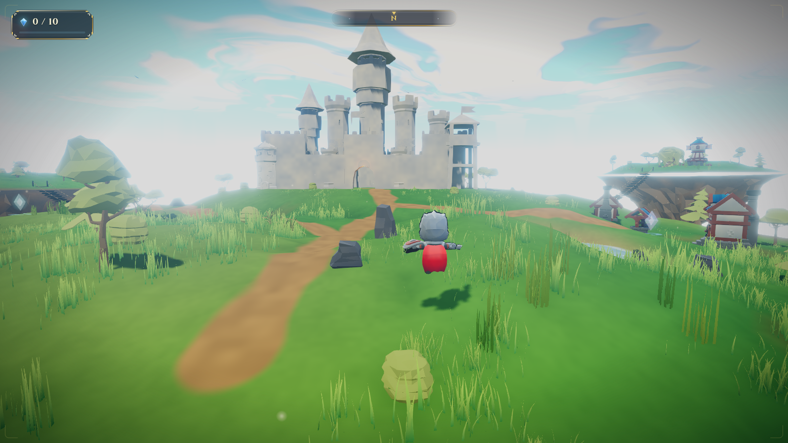

# Floating Isles

**▶ Play it now: <https://ravejedii.github.io/3D-ISLAND/>** — works on desktop and mobile.

A stylized 3D adventure that runs in the browser. A scattered kingdom drifts in
the endless sky — cross rope bridges between five floating islands, walk into
the castle through its gatehouse, and recover the 10 lost sky crystals.

Built with Three.js and a custom painterly rendering stack; the art direction
aims at the cel-shaded adventure-game family (soft banded light, painted
foliage, drawn UI) rather than photorealism or a tech demo.



## Run it locally

Prerequisites: **Node 20+** and **pnpm** (`corepack enable` ships pnpm with Node).

```bash
git clone https://github.com/ravejedii/3D-ISLAND.git
cd 3D-ISLAND
pnpm install      # exact versions from pnpm-lock.yaml
pnpm dev          # http://localhost:5173 — hot reload, no other services needed
```

There is no backend, no database, no API keys: the entire game is static files.
`pnpm build && pnpm preview` serves the exact bundle that ships to production.

| Input | Action |
| --- | --- |
| `WASD` / arrows | Move |
| `Shift` | Run |
| `Space` | Jump (buffered — a press just before landing still fires) |
| Mouse | Look (click to capture the pointer) |
| Scroll | Zoom camera |
| `Esc` | Pause |
| `M` | Mute |

**On phones/tablets** the game detects touch and switches to mobile controls:
left thumb = virtual joystick (push to the rim to run), right thumb = drag to
look / pinch to zoom, on-screen jump and pause buttons. Mobile gets its own
render path (no post-processing) tuned for phone GPUs.

## What's inside

- **Painterly renderer** (`src/render/painterly.js`) — a non-photorealistic
  material stack shared by the whole world: a tinted toon ramp (warm light,
  blue-violet shadow), sky-coloured rim light along silhouettes, foliage
  translucency (sun bleeding through leaves), and world-space painted mottling.
  Sun direction and sky colour feed every material each frame, so the look
  tracks the full day/night cycle.
- **Painted sky** (`src/render/clouds.js`) — a cumulus deck from domain-warped
  fBm, lit by sampling density toward the sun (silver linings, blue shadowed
  interiors), over an atmospheric-scattering dome, stars, and a day/night
  palette.
- **Authored assets** (all CC0, provenance in [`ASSET_LICENSES.md`](ASSET_LICENSES.md)) —
  the castle is assembled from the Quaternius Modular Medieval Buildings kit
  (curtain walls, gatehouse, stepped towers, cloth-animated banners) and merged
  into a single batched mesh; trees, rocks, bushes and ground flora are
  Quaternius Stylized Nature models instanced with per-instance tint/lean/scale
  and an authored foliage palette; the player is KayKit's rigged, animated
  Knight (idle/walk/run/jump via AnimationMixer). Every asset loads through a
  central manager and degrades to a procedural fallback if missing
  (`?noassets` simulates this).
- **World** — five floating islands from an analytic heightfield (the same
  math drives rendering and collision), a flattened castle plateau, clump-based
  meadow grass (26k+ blades in wind), sagging rope bridges, waterfalls, a pond
  with a reeded, stony shore, and dirt paths, rock scree, a wet-sand waterline
  and the keep's paved forecourt all painted in the terrain shader. Inside the
  curtain wall the bailey is dressed as a working yard — archery butts and pell
  dummies on one side, a market stall and its stock on the other — batched into
  a single mesh.
- **Gameplay** — third-person controller with capsule collision, ledge step-up,
  bridge rails, void respawn, footstep/landing dust and audio; 10 crystals,
  win screen with your time.
- **UI** (`src/ui/`) — hand-drawn SVG artwork: a winged sky-crystal crest,
  filigree corner pieces, chamfered cut-plate surfaces, a struck-metal
  wordmark. No stock component styling.
- **Performance** — instanced/merged geometry (~61 draw calls, ~144k
  triangles), adaptive quality stepping, and a software-rasterizer detector
  that switches to a fast preset (`?lowgfx` forces it).

## Project structure

```
src/
  main.js            entry: renderer, post chain, asset manifest, game loop
  core/assets.js     glTF manager — progress, caching, procedural fallbacks
  render/            painterly.js (NPR materials) · clouds.js (sky deck)
  world/             islands, castle_modular, props, grassfield, sky, water…
  player/            controller.js (movement + animation) · camera.js
  ui/                hud.js · frames.js (hand-drawn SVG) · style.css · touch.js
  effects/dust.js    pooled traversal particles
public/assets/models CC0 GLB/GLTF assets (provenance: ASSET_LICENSES.md)
scripts/             visual-gate, ui-gate, art-shot, decimate-glb
tests/               Playwright: e2e, perf budget, mobile
tools/router-loop/   vendored self-driving improvement loop (island.spec.json)
art-review/          before/after hero captures + change reports
```

Every bundled asset's author, license and source URL is recorded in
[`ASSET_LICENSES.md`](ASSET_LICENSES.md) — all CC0, nothing ripped.

## Development

```bash
pnpm build        # production build to dist/
pnpm preview      # serve the production build on :4173
pnpm test         # Playwright e2e + perf suite (23 tests, desktop + mobile)
node scripts/visual-gate.mjs   # deterministic render checks (both paths)
node scripts/ui-gate.mjs       # deterministic UI craft floor
node scripts/hero-gate.mjs     # character portrait vs approved baseline + structure grounding
node scripts/art-shot.mjs art-review/after.png   # reproducible hero framing
```

The test suite drives the real game in headless Chromium: bridge crossings
with no teleports, crystal collection through the castle gate, win state,
falling off the world, mobile touch controls, and an FPS tour (thresholds
calibrated for software rendering in CI; `PERF_MIN_FPS` overrides on real
GPUs). Two additional deterministic gates assert pixel facts about rendered
frames and a craft floor for the UI — no vision model involved. Art changes
are reviewed against `art-review/before.png` / `after.png` captured from the
same camera by `scripts/art-shot.mjs`.

`tools/router-loop/` vendors a self-driving improvement loop
(plan → work → verify) whose spec for this repo lives in `island.spec.json`;
its verify gate runs the full pipeline above, and visual approval stays with
a human.

## Deployment

Every push to `main` deploys automatically: the GitHub Actions workflow in
`.github/workflows/deploy.yml` builds with pnpm and publishes `dist/` to
GitHub Pages. The build uses relative asset paths, so it works from any
subpath.
