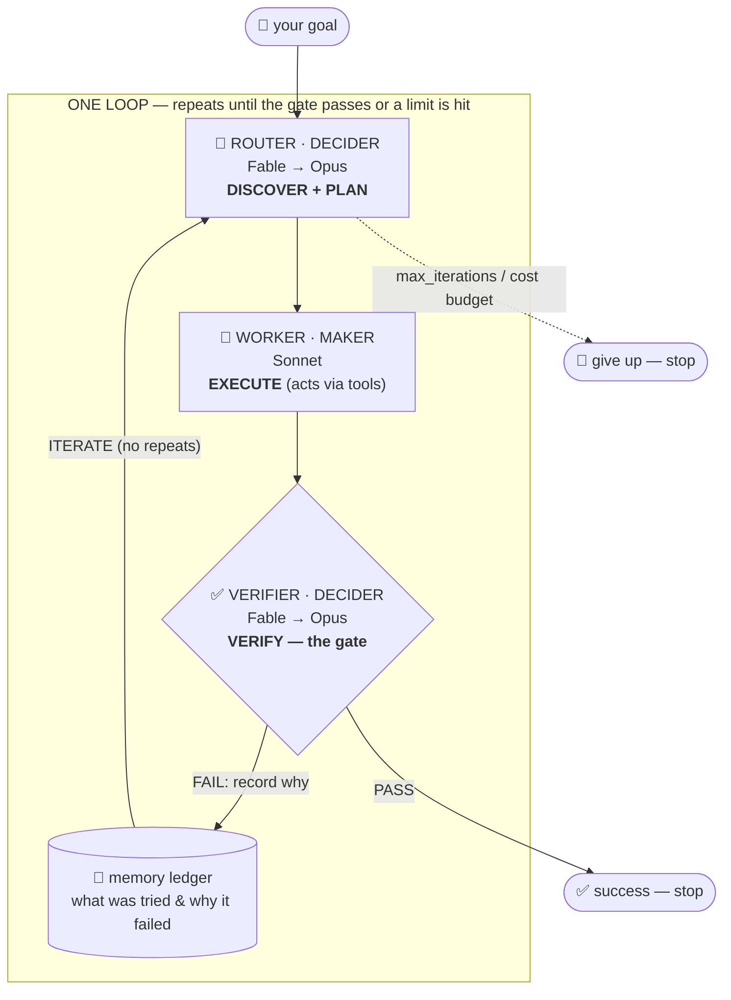

# router-loop

A self-driving agentic **loop**, backed by your **Claude subscription**.

You give it a goal once. It runs the full cycle on its own until the goal is
actually met (or it hits a hard limit), then reports back:

```
DISCOVER  →  work out what needs doing        ┐
PLAN      →  decide the single next step        │  router
EXECUTE   →  do the work                        ┘  worker
VERIFY    →  check it against a real gate       ─  verifier
ITERATE   →  not there yet? feed it back and go again
```

It is called *router*-loop because a central **router** inspects the current
state each pass and decides the one highest-impact next step — it routes the
loop toward the goal instead of you walking it through every move.

Every model call runs through the Claude Code CLI in headless mode
(`claude -p`), so the whole loop uses your **Pro/Max subscription** — no
`ANTHROPIC_API_KEY`, no metered API billing.

## At a glance



The only way to *succeed* is **VERIFIER → PASS** — the worker's own "I'm done"
never ends the loop. **→ Full walkthrough with more diagrams:
[`docs/ARCHITECTURE.md`](docs/ARCHITECTURE.md).**

---

## Why this is a *loop* and not just repeated prompting

Four things separate a real loop from an agent talking to itself. This project
builds each one in:

| Piece | Where it lives | What it does |
|---|---|---|
| **Verify gate** | `verifier.py` | A real check — a shell command, a strict rubric, or a human. **Required**: a spec with no gate is rejected. See **[What is a gate?](#what-is-a-gate)** |
| **State / memory** | `state.py` | A ledger of what was tried and how it went, persisted every step. The router reads it so it never repeats a failed approach. Loops are resumable. |
| **Stop condition** | `loop.py` | Two ways out besides success: a hard `max_iterations` cap and an optional `max_cost_usd` budget. |
| **Maker ≠ checker** | `worker.py` vs `verifier.py` | The agent that does the work never decides whether it's done. Only the gate can end the loop. |

The last one matters most. In the smoke test below, the worker declared
*"Goal complete."* **twice** while writing to the wrong place — and the gate
caught it both times. That is the whole point: the model that did the work is
far too generous a grader of it.

---

## What is a gate?

**The gate is the check that decides whether the work is done — the only thing
that can end the loop.** Each pass runs plan → work → **gate**; pass = stop,
fail = feed the reason into memory and try again. Its verdict has to be
trustworthy and independent of the agent that did the work, which is why it's a
separate thing.

There are three kinds:

| Gate | What it is | Cost | Trust | Use when |
|---|---|---|---|---|
| **Command** | a shell command, exit `0` = pass (`pytest`, `npm test`, `tsc`, a pixel-diff) | none | highest — ground truth | there's *any* command that proves it |
| **Rubric** | a *separate* model scores concrete criteria 1–10 | ~1 call/iter | medium — it's judgment | nothing runs, but quality is describable in sharp criteria |
| **Human** | you look and approve / give feedback | none | highest for *taste* | it's a judgment/visual call (needs you present) |

### Taste-based & visual work — the honest version

**Pure taste ("does this *look* premium?") cannot be gated by a machine.** If
you point a loop at that with an LLM grading its own screenshots, you get exactly
the failure you may have hit: it burns tokens trying to "see" its own output, the
visual evidence half-materializes, and it grades itself too kindly. Don't. Instead:

- **Split it.** Most visual work hides objective, cheaply-checkable facts —
  builds clean, no console errors, expected computed styles, contrast ≥ 4.5:1,
  no overflow, a **screenshot pixel-diff under N% vs an approved baseline**.
  Those are all **command gates**, no vision model. Gate the substrate; leave
  only real taste to a person.
- **Use a `human_gate`** for the taste that's left: the worker renders the page
  and saves a screenshot *once*, then **you** judge — zero tokens on
  self-verification, and your feedback is remembered for the next pass.
- **Or don't loop.** One-off + pure taste = one good prompt, not a loop.

**→ Full guide with a copy-paste deterministic visual gate: [`docs/GATES.md`](docs/GATES.md).**

---

## Install

```bash
pip install -e .          # exposes the `router-loop` command
# or just run in place:
python -m router_loop --help
```

Requires the Claude Code CLI on your `PATH`, logged in to your subscription
(`claude` — check with `claude --version`). No other dependencies.

## Quick start

### 1. An ad-hoc loop with a *command gate* (the strongest kind)

```bash
python -m router_loop run \
  --goal "All tests under ./tests pass" \
  --gate-command "python -m pytest -q" \
  --worker-tool Read --worker-tool Edit --worker-tool Bash \
  --worker-permission-mode acceptEdits \
  --max-iters 8 --max-cost 5.0
```

### 2. A loop from a saved spec (the reusable "skill")

Instead of retyping instructions, save them once as a spec file the loop reads
every run:

```bash
python -m router_loop run --spec examples/fix_tests_spec.json
```

See [`examples/fix_tests_spec.json`](examples/fix_tests_spec.json) (command
gate, coding) and [`examples/writer_spec.json`](examples/writer_spec.json)
(rubric gate, writing).

### 3. Resume an interrupted loop

State is saved after every iteration, so a killed loop picks up where it left
off instead of starting from zero:

```bash
python -m router_loop resume --spec examples/fix_tests_spec.json --state .router/state.json
python -m router_loop status --state .router/state.json
```

### 4. Put it on a heartbeat (automation)

A loop only becomes hands-off once something triggers it for you.
[`examples/run_scheduled.sh`](examples/run_scheduled.sh) is a cron-ready
wrapper. Inside Claude Code you can get the same effect with `/loop` (re-run on
an interval) or `/goal` (run until a condition is true).

---

## Use it on every project you work on

The loop is project-agnostic — the only thing that changes per project is the
**gate** (the command that proves the work is done).

### Drop it into a new repo and let it crank

The whole `router_loop/` package is pure Python with **zero dependencies**, so
you just vendor it in — no install, nothing to break:

```bash
git clone <this-repo-url> ~/tools/router          # once
cd ~/my-new-project
~/tools/router/bootstrap.sh                        # copies router_loop/ in + scaffolds a spec
# open router.spec.json, confirm the goal + gate, then:
python3 -m router_loop run --spec router.spec.json
```

`bootstrap.sh` copies `router_loop/` into the current repo and runs `init` for
you. For a test-driven repo the scaffolded spec's goal and gate are filled in
from what it detects, so it can crank as-is.

> Prefer a global command instead of vendoring? `pipx install git+<this-repo-url>`
> puts `router-loop` on your `PATH` in every project. Same zero deps.

### Model hierarchy — Fable orchestrates, Opus is the safety net

Each role has a default **model preference chain**, tried in order until one
answers:

| Role | Default chain | Why |
|---|---|---|
| **Router** (decider — plans) | `claude-fable-5` → `claude-opus-4-8` | Fable sits at the top and decides each step; if it's unavailable **or out of credits**, Opus takes over automatically. |
| **Verifier** (decider — judges) | `claude-fable-5` → `claude-opus-4-8` | The other decider: a strict, separate grader, same Fable→Opus chain. |
| **Worker** (maker — does the work) | `claude-sonnet-5` | Fast and cheap; the grunt doesn't need to be the smartest model. |

You don't configure this — it's the default. The fallback is handled in-process
(the CLI's own `--fallback-model` covers *overload* but not the credit/limit
`429`, so the loop catches that itself). When it happens you'll see it in the
output:

```
[model] 'claude-fable-5' unavailable (You've reached your Fable 5 limit...); falling back to 'claude-opus-4-8'.
```

Override per role in a spec only if you need to:

```json
"router": { "model_chain": ["claude-fable-5", "claude-opus-4-8"] },
"worker": { "model": "claude-sonnet-5" }
```

### Scaffold a spec — it auto-detects the gate

```bash
cd ~/some/project
router-loop init --goal "All tests pass and the build is clean"
```

`init` inspects the repo and writes a starter `router.spec.json` with the right
verifier already filled in:

| It sees… | Gate it picks |
|---|---|
| `package.json` with a `test` script | `npm test` |
| `Cargo.toml` | `cargo test` |
| `go.mod` | `go test ./...` |
| `pyproject.toml` / `tests/` | `python -m pytest -q` |
| `Makefile` | `make test` |
| anything else | a `TODO` gate it flags for you to fill in |

Open the file, sharpen the `goal`, and **confirm the gate command actually
proves that goal** — then commit `router.spec.json`. That committed spec is the
reusable "skill" for the project: written once, read every run.

### Run it, from a schedule or by hand

```bash
router-loop run --spec router.spec.json
```

### Invoke it from inside Claude Code (any session)

Copy the bundled skill so it's available in every project:

```bash
cp -r skill/router-loop ~/.claude/skills/router-loop
```

Now in any Claude Code session you can say *"run a router loop until the tests
pass"* and Claude will scaffold the spec, confirm the gate, run the loop, and
report the outcome and cost — using [`skill/router-loop/SKILL.md`](skill/router-loop/SKILL.md),
which also encodes the guardrails (never weaken the gate, trust the verifier not
the worker). This is separate from the built-in `/loop` (a plain interval
re-run) — this one is the gated, verified loop.

---

## Spec format

A spec is the full definition of one loop. Minimal example:

```json
{
  "goal": "All tests under ./tests pass and pyflakes is clean.",
  "workdir": ".",
  "worker": {
    "model": "claude-sonnet-5",
    "allowed_tools": ["Read", "Edit", "Write", "Bash"],
    "permission_mode": "acceptEdits"
  },
  "command_gate": { "command": "python -m pytest -q && python -m pyflakes ." },
  "max_iterations": 8,
  "max_cost_usd": 5.0
}
```

| Field | Meaning |
|---|---|
| `goal` | The recursive goal the loop works toward. |
| `workdir` | Where the worker acts and the command gate runs. |
| `router.model` / `worker.model` | Model alias per role. Make the worker fast/cheap and the rubric checker slower/stricter. |
| `worker.allowed_tools` | Tools the worker may use, so it *acts* (edits files, runs commands) instead of only describing. |
| `command_gate.command` | Shell command that must exit `0`. Authoritative when present. |
| `rubric_gate.criteria` / `.threshold` | A separate checker model scores each criterion 1–10; all must clear the threshold. |
| `human_gate.prompt` / `.evidence_hint` | You are the verifier — approve or give feedback. Zero tokens; for taste/visual work. Needs an interactive terminal. |
| `max_iterations` / `max_cost_usd` | The two stop conditions. |

At least one of `command_gate` / `rubric_gate` / `human_gate` is **required** —
see [`docs/GATES.md`](docs/GATES.md) for how to choose.

---

## When is a loop worth it?

Straight from the article this implements — build one only when **all four** are
true, otherwise keep it a single good prompt:

1. The task **repeats** (at least weekly).
2. Something can **automatically reject** bad output (a gate exists).
3. The agent can do the work **end to end**.
4. "Done" is **objective**, not a matter of taste.

The metric that actually matters is **cost per accepted change**, not tokens
spent. The loop prints total and per-iteration cost so you can watch it. Below a
~50% accept rate, a loop costs more than it gives back.

---

## Architecture

```
router_loop/
  model.py      ClaudeSubscriptionModel — drives `claude -p` (subscription auth)
  config.py     LoopSpec / gates / stop conditions
  state.py      persistent memory ledger (resumable)
  router.py     DISCOVER + PLAN  → the single next step
  worker.py     EXECUTE          → does the work, can use tools to act
  verifier.py   VERIFY           → command gate + rubric gate (separate checker)
  loop.py       the five-phase orchestrator + stop conditions
  scaffold.py   project detection + `init` spec generation
  cli.py        init / run / resume / status
```

Any object with a `complete(...)` method can replace the model backend, which is
how the test suite runs the whole loop deterministically and for free.

## Development

```bash
python -m unittest discover -s tests -v   # zero-dependency test suite
# or: pytest -q
```

The tests inject a deterministic fake model, so they exercise convergence, the
max-iterations stop, the rubric gate, resumability, and the "router believes
it's done but the gate says no" guardrail — without spending a token.
