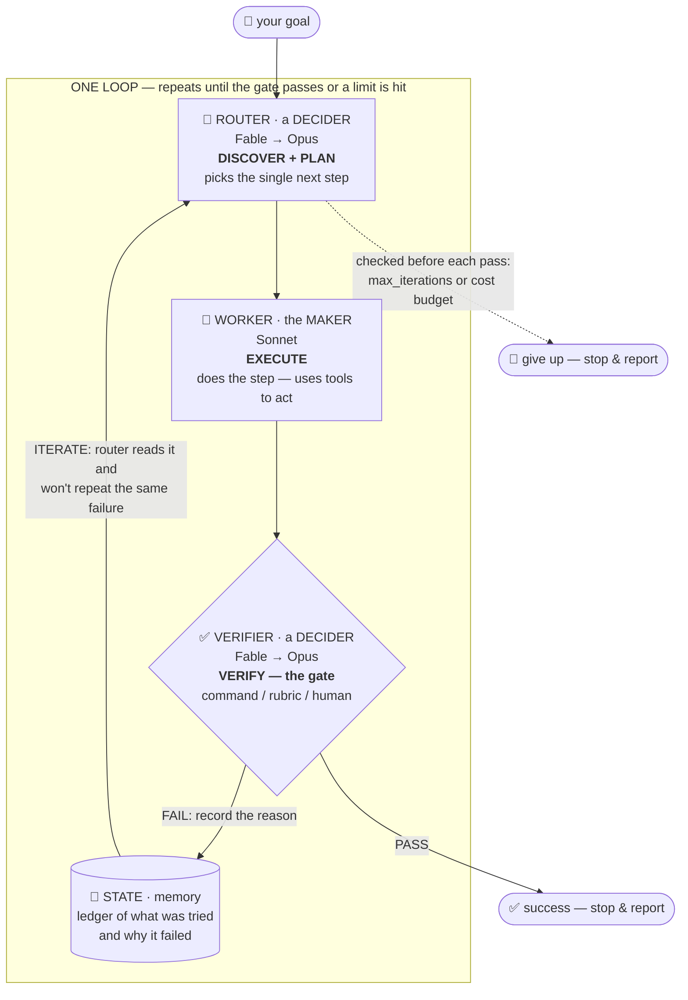
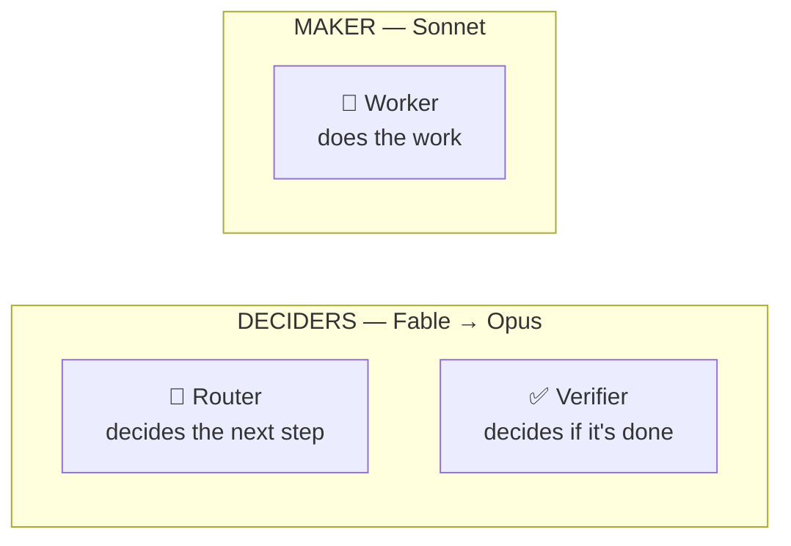
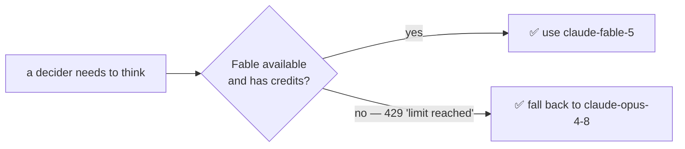
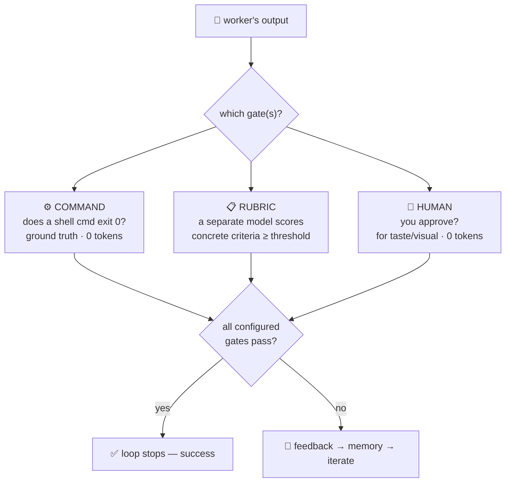

# How the router loop actually works

A picture and a plain-English walkthrough of what happens when you run a loop.
The Mermaid diagrams below render automatically on GitHub; an ASCII version of
the main one follows in case you're reading in a plain editor.

## The big picture



The single most important arrow is **VERIFIER → PASS**. That is the *only* way
the loop ends in success. The worker saying "I'm done" means nothing; only the
gate can end the loop. That's what stops it from quitting on half-finished work.

### Same thing, in ASCII

```
              ┌───────────────────────────────────────────────┐
   🎯 goal ──▶│                  ONE LOOP                      │
              │                                               │
              │   🧭 ROUTER  ── decides the next step         │
              │   (Fable→Opus)         │                      │
              │                        ▼                      │
              │   🔨 WORKER  ── does the step (Sonnet)        │
              │                        │                      │
              │                        ▼                      │
              │   ✅ VERIFIER ── runs the GATE (Fable→Opus)   │
              │   (command / rubric / human)                  │
              │              │                 │              │
              │         PASS │                 │ FAIL         │
              │              ▼                 ▼              │
              │        ✅ success        📓 write reason to   │
              │        stop & report        memory, then ────┐│
              │                             back to ROUTER ◀──┘│
              └───────────────────────────────────────────────┘
   Before each pass: if max_iterations or the cost budget is hit → 🛑 stop.
```

## One iteration, step by step

1. **Check the limits first.** Before doing any paid work, the loop checks the
   two stop conditions — `max_iterations` and `max_cost_usd`. If either is hit,
   it stops and reports instead of spending more.
2. **DISCOVER + PLAN (router).** The router reads the goal, the memory ledger
   (everything tried so far and why it failed), and the last gate feedback, then
   picks the **single** highest-impact next step.
3. **EXECUTE (worker).** The worker does that one step. If it has tools
   (`Read`/`Edit`/`Write`/`Bash`), it actually changes files and runs commands —
   it *acts*, it doesn't just describe.
4. **VERIFY (the gate).** A **separate** verifier checks the result — a shell
   command, a rubric scored by a different model, or you. See
   [GATES.md](GATES.md).
5. **ITERATE or STOP.** Gate passes → success, stop. Gate fails → the reason is
   written to memory and control goes back to the router, which now knows not to
   repeat that approach.

## Who does what — and on which model



| Role | Job | Model | Why this model |
|---|---|---|---|
| **Router** | plan the next step | Fable → Opus | Deciding well matters most; put the strong model here. |
| **Verifier** | judge "done or not" | Fable → Opus | The grader must be strict and independent of the worker. |
| **Worker** | do the grunt work | Sonnet | Cheap and fast; the doer doesn't need to be the smartest. |

**Maker ≠ checker on purpose.** The worker (Sonnet) never gets to decide whether
its own work is good — the verifier (Fable/Opus) does. The model that wrote the
work is far too generous a grader of it.

## The model fallback (Fable → Opus)

Each decider prefers Fable but drops to Opus automatically when Fable is
unavailable or you're out of credits:



The Claude CLI's own `--fallback-model` only handles *overload*, not the
credit-limit `429`, so the loop catches that itself and moves down the chain.
When it happens you see a line like:
`[model] 'claude-fable-5' unavailable (...); falling back to 'claude-opus-4-8'.`

## The gate, up close



Full explanation of the three gate types and how to pick one — including
taste/visual work — is in [GATES.md](GATES.md).

## Where each piece lives in the code

```
router_loop/
  loop.py       ── the orchestrator: runs the cycle, checks stop conditions
  router.py     ── 🧭 DISCOVER + PLAN   (decider)
  worker.py     ── 🔨 EXECUTE           (maker)
  verifier.py   ── ✅ VERIFY            (the gate: command / rubric / human)
  state.py      ── 📓 the memory ledger (persisted, resumable)
  model.py      ── drives `claude -p`; the Fable→Opus fallback chain lives here
  config.py     ── the spec: goal, gates, models, stop conditions
  scaffold.py   ── `init`: detect a project's gate and write a starter spec
  cli.py        ── init / run / resume / status
```
